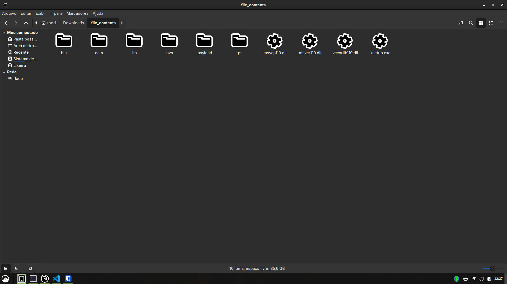
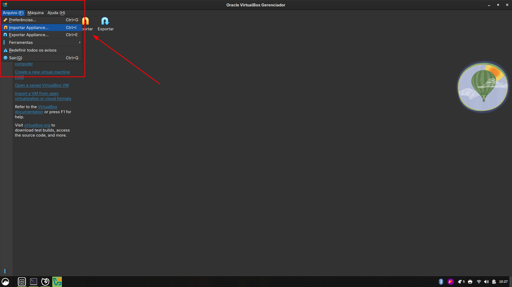
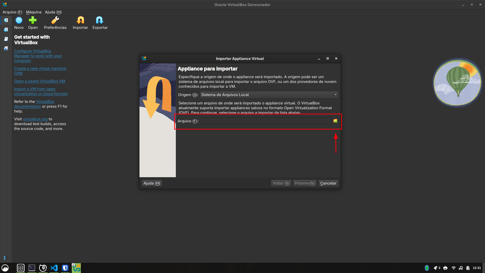
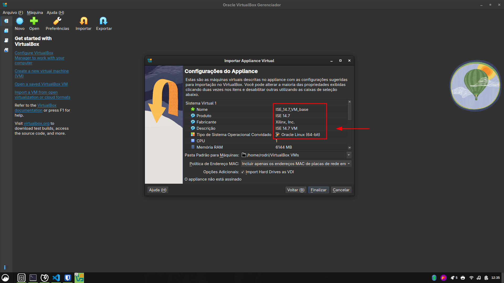

<div align="center">
  <h3 align="center">Introduction</h3>
  <p align="center">
    Installation Guide
  </p>
  <p align="center">
    <a href="https://download.virtualbox.org/virtualbox/7.1.0/VirtualBox-7.1.0-164728-Win.exe">VirtualBox</a>
    &nbsp;·&nbsp;
    <a href="https://download.virtualbox.org/virtualbox/7.1.0/Oracle_VirtualBox_Extension_Pack-7.1.0.vbox-extpack">Extension Pack</a>
    &nbsp;·&nbsp;
    <a href="https://www.xilinx.com/downloadNav/vivado-design-tools/archive-ise.html">ISE 14.7 VM</a>
  </p>
</div>

---

<!-- TABLE OF CONTENTS -->
<details>
<summary>Table of Contents</summary>
<ol>
  <li><a href="#prerequisites">Prerequisites</a></li>
  <li><a href="#installation">Installation</a></li>
  <li>
    <a href="#oracle-virtualbox-setup">Oracle VirtualBox Setup</a>
    <ul>
      <li><a href="#post-installation-configuration">Post-Installation Configuration</a></li>
    </ul>
  </li>
  <li><a href="#mentors">Mentors</a></li>
</ol>
</details>

> [!IMPORTANT]
> This step-by-step is heavily based on the work of Professor Ney Laert Vilar Calazans, so all credits go to him.

---

### :fountain_pen: Prerequisites

1. A machine running Windows 10 or later
2. At least 20 gigabytes of available storage

---

### :computer: Installation

Before starting, download the following packages:

1. **Oracle VirtualBox** (7.1.0-164728) — [Download](https://download.virtualbox.org/virtualbox/7.1.0/VirtualBox-7.1.0-164728-Win.exe)
2. **VirtualBox Extension Pack** (7.1.0) — [Download](https://download.virtualbox.org/virtualbox/7.1.0/Oracle_VirtualBox_Extension_Pack-7.1.0.vbox-extpack)
3. **ISE 14.7 VM** — [Archive page](https://www.xilinx.com/downloadNav/vivado-design-tools/archive-ise.html) — Select version **14.7 Windows 10**.

---

### Oracle VirtualBox Setup

1. Extract the previously downloaded **ISE 14.7 VM**, it should look something like this:

   

2. Go to the menu **"File"** and click on **"Import Appliance"**, as shown below:

   

3. If everything went right, this window should appear:

   

   Now, choose the file **`14.7_VM.ova`** located at **`ova/14.7_VM.ova`** inside the extracted folder.

   

   If everything looks similar to the image above, press **Finish** and wait for the installation to complete.

---

### :gear: Post-Installation Configuration

After the installation above, boot the **ISE 14.7 VM**. VirtualBox may detect suboptimal settings that should be adjusted **while the VM is not running**:

> **Memory Adjustment**
>
> On machines with 4 GB of RAM, reduce the VM's allocated memory (under **System** in the OVB Manager) from 4 GB to **1909 MB** — keeping it below half the host machine's total memory.

> **Graphics Controller**
>
> Under **Display**, change the graphics controller to **VMSVGA**.
> ⚠️ Note: Testing showed that VMSVGA makes screen resizing more cumbersome. The option **VBoxSVGA** may offer a better experience and is a valid alternative.

> **Keyboard Capture**
>
> When launching the ISE VM, **accept the automatic keyboard capture suggestion**. Manual keyboard configuration does not present options such as *Português ABNT2*. Accepting or rejecting mouse capture appears to have no significant effect.

> **Enabling Network Access**
>
> To enable internet access inside the VM, follow the [ISE 14.7 VM installation manual](https://docs.amd.com/v/u/en-US/ug1227-ise-vm-windows10) (Chapter 6 — *Enabling Full Networking*):
> - With the VM stopped, open the OVB Manager
> - Select the ISE 14.7 VM and go to **"Network"**
> - Under **Adapter 1**, set **"Attached to:"** to **NAT**

> **Sharing a Project Folder Between the VM and Host**
>
> To share your ISE project folder between the VM and the host machine:
>
> In the OVB Manager (with the VM stopped), select the ISE 14.7 VM and open **"Shared Folders"**.
>
> Click **"Add new shared folder"** (blue folder icon with a green `+` in the top-right corner of the window).
>
> In **"Folder Path"**, enter the path to your projects directory, e.g.:
> ```
> C:\Xilinx\ise_projs
> ```
> *(Adjust if you used a different location.)*
>
> In **"Folder Name"**, set the name the folder will have inside the VM, e.g.:
> ```
> ise_projs
> ```
>
> Check **"Auto-mount"** and click **OK**.
>
> *(Optional)* To create a shortcut on the VM Desktop, open a terminal inside the VM and run:
> ```bash
> cd /home/ise/Desktop
> ln -s /home/ise/ise_projs ise_projs
> ```
> The shared folder will be accessible at `/home/ise/ise_projs` inside the VM.

---

### :old_key: Mentors

> Prof. Ney • Prof. Rodrigo