

  
  <h3 align="center">Project 1</h3>
  
Using the Xilinx ISIM Simulator

  

    <a href="./project_files/project_1/">Project Files</a> |
    <a href="https://github.com/LigaProtoFPGA/docs/blob/main/setup-ise-vm.md">Previous Project</a> |
    <a href="./project_2.md">Next Project</a>
  

---

Table of Contents

<ol>
  <li><a href="#prerequisites">Prerequisites</a></li>
  <li><a href="#creating">Creating the Project Files</a></li>
  <li><a href="#creating2">Creating a Project in ISE for Nexys 1 or Nexys 2 FPGA's</li>
  <li><a href="#using">Using the Xilinx ISIM Simulator</li>
  <li><a href="#mentors">Mentors</a></li>
</ol>

> [!IMPORTANT]
> This step-by-step is heavily based on the work of Professor Ney Laert Vilar Calazans, so all credits go to him.

---

### :fountain_pen: Prerequisites

1. Have ISE 14.7 VM installed and configured, if you don't have it, please go [here](https://github.com/LigaProtoFPGA/docs/blob/main/setup-ise-vm.md)

---

### :file_folder: Creating the Project Files

1. Create a working folder, named, for example, **halfadder**

2. In that folder, create two source files with **VHDL** extension and the contents of [these files](./project_files/project_1/)

---

### :computer: Creating a Project in ISE for Nexys 1 or Nexys 2 FPGA's

1. Open ISE and if a project opens on startup, close it in File then Close Project, as shown below:

  

2. Create a new project named **haldadd** clicking on the button **New Project**, as shown below:

> [!WARNING]
> Choose a folder that you're sure you have permission to write.

  

3. Fill the name field as shown below and click on **Next**:

> [!WARNING]
> Don't use special characters in the project name or path.

  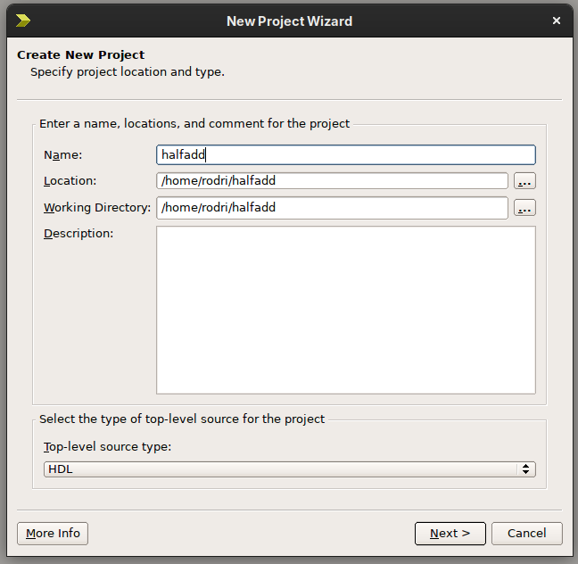

4. Change the fields according to the board you're using:

For **Nexys 2** with size **1200**:

> [!WARNING]
> If you're using a device with size **500**, choose **XC3S500E** instead.

  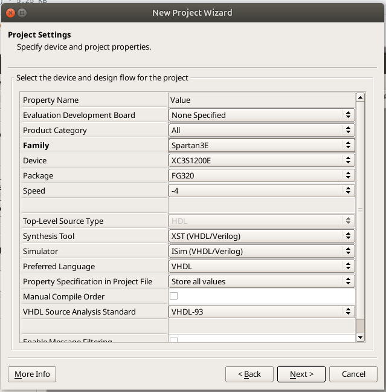

For **Nexys 1**:

  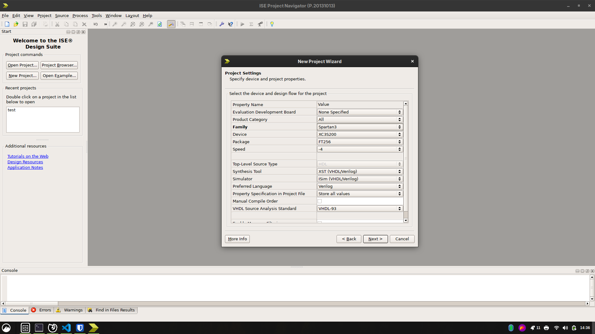

5. In the final window, check everything and then click on finish, as shown below:

  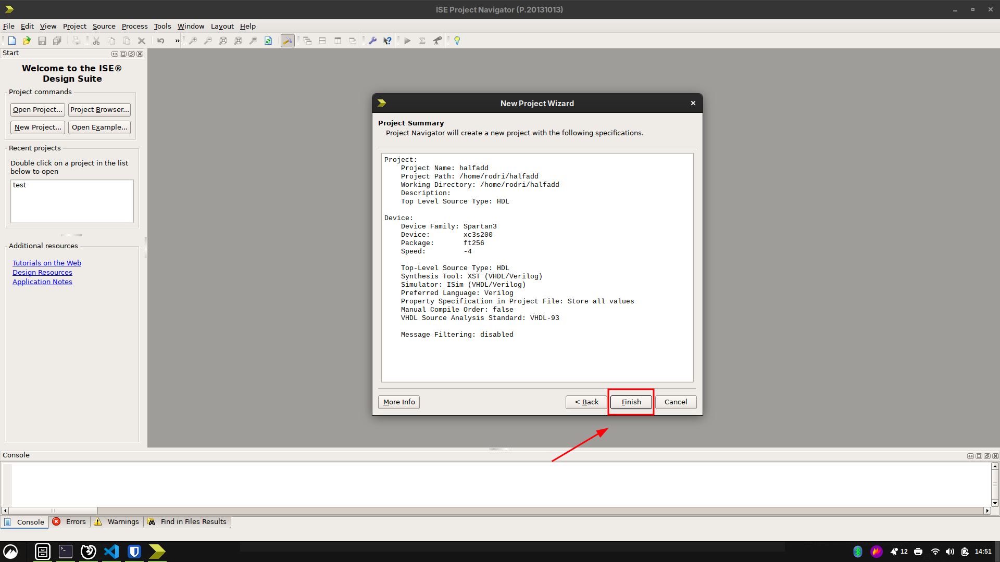

---

### :fountain_pen: Using the Xilinx ISIM Simulator

1. In ISE, click with the right button on the FPGA icon in the **Hierarchy** window, and then **Add Copy of Source**, as shown below:

  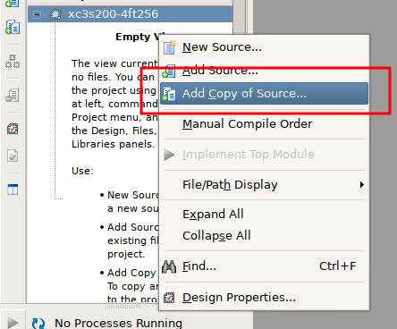

2. Then add the two VHDL files created in previous steps, and click **OK**:

  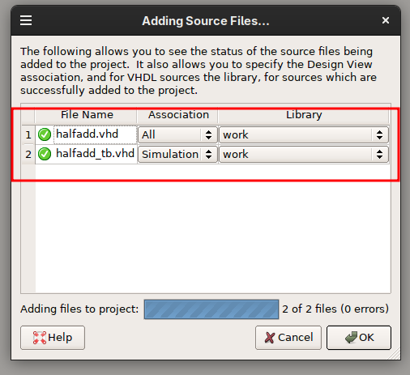

> [!NOTE]
> Notice that ISE detected correctly the files, because **halfadd_tb.vhd** was marked as **Simulation** and **halfadd.vhd** as **All**, indicating that it contains synthesizable VHDL code.

3. In the **View** tab, choose **Simulation**:

  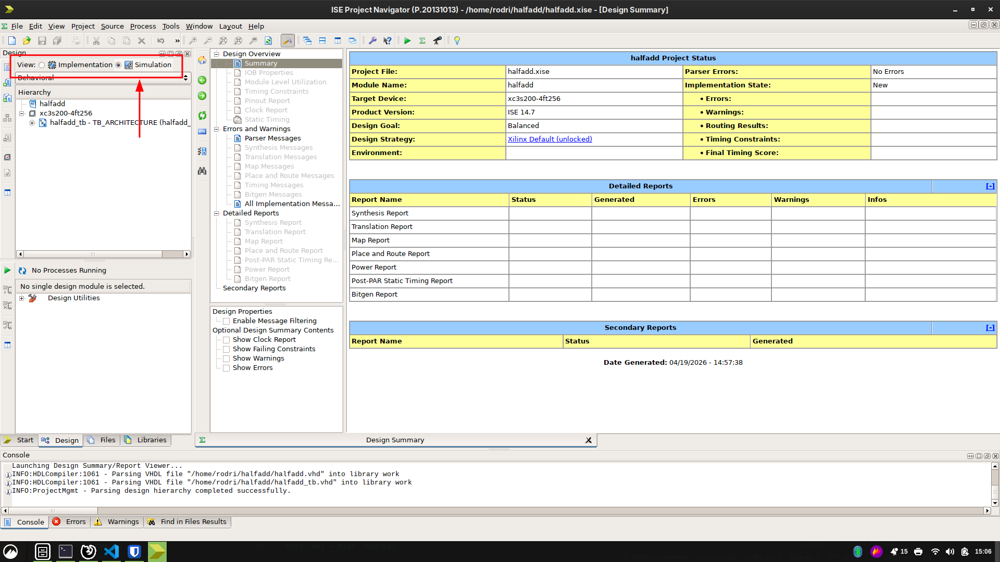

4. Select the **halfadd_tb.vhd** file in the **Hierarchy** window.

  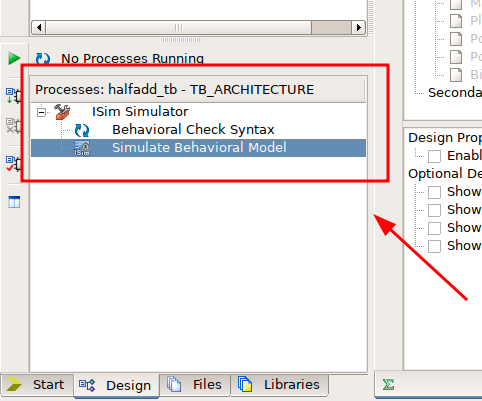

5. Now in the **Processes** tab, do a double click in **Behavioral Check Syntax**, to verify if the testbench has any errors.

> [!IMPORTANT]
> Do the same for the **halfadd.vhd** file, clicking in the plus sign in the **Hierarchy** tab.

  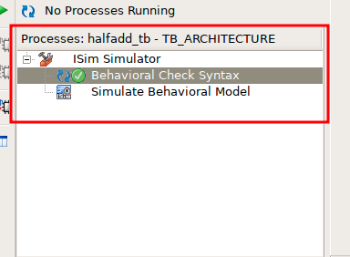

6. To setup the simulation, select again the **halfadd_tb.vhd** file in the **Hierarchy** tab and then click with the right button in **Simulate Behavioral Model** in the **Process** tab, then change the **Property Display Level** to **Advanced** and the **Simulation Run Time** to **50 ns** and apply.

  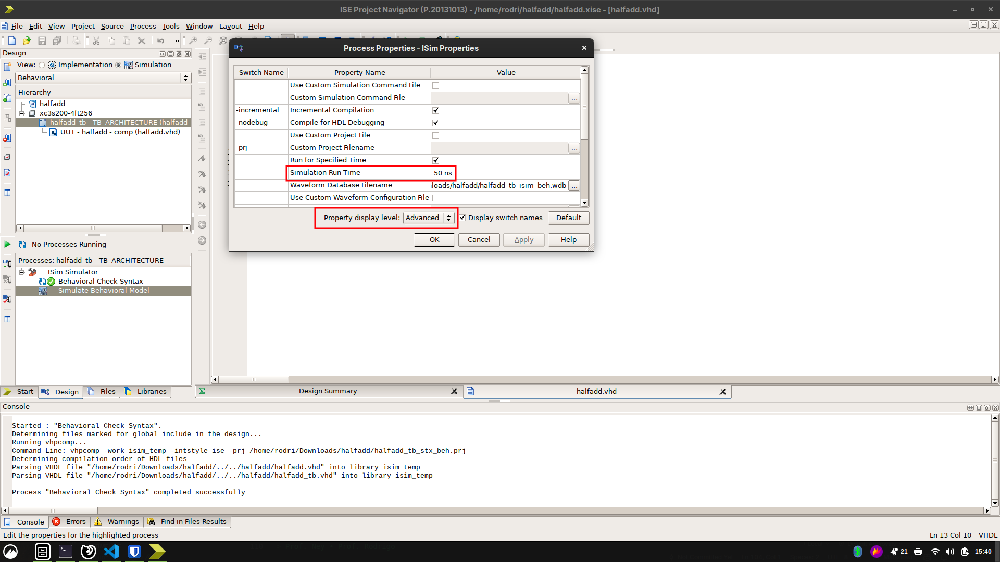

7. To simulate, do a double click on **Simulate Behavioral Model** in the **Processes** tab, it should open a window similar to the shown in the image below. This is the **waveform** window that draws 50 nanoseconds of the circuit simulation.

> [!TIP]
> Adjust the waveform using the buttons indicated below.

  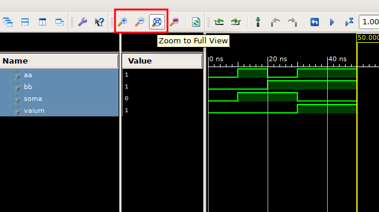

  <strong>You've reached the end! <a href="project_2.md">Next Project</a></strong>

---

### :old_key: Mentors

<table border="0" cellspacing="0" cellpadding="10">
  <tr>
    <td>
      
    </td>
    <td valign="middle">
      <strong>Prof. Ney Calazans</strong>
    </td>
  </tr>
  <tr>
    <td>
      
    </td>
    <td valign="middle">
      <strong>Prof. Rodrigo Pereira</strong>
    </td>
  </tr>
</table>