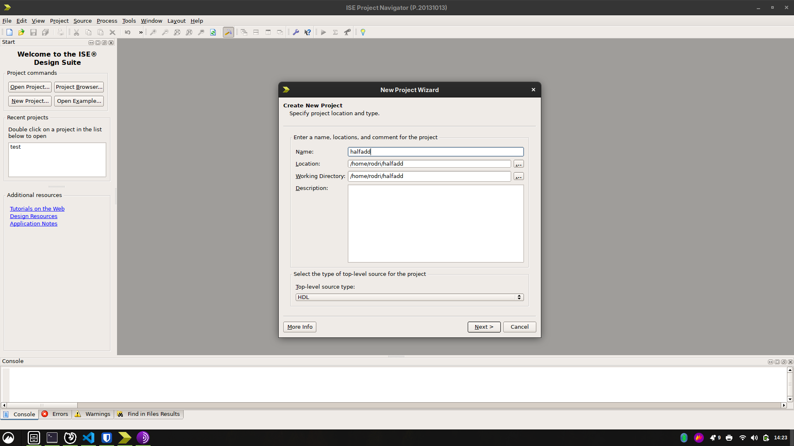
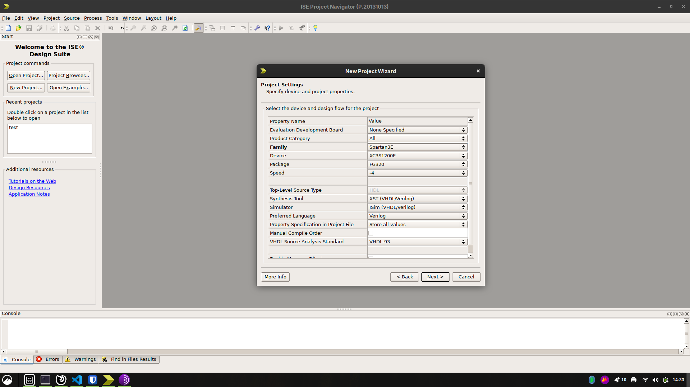

  <h3 align="center">Project 2</h3>
  

    Using the Xilinx ISIM Simulator
  

---

<!-- TABLE OF CONTENTS -->

Table of Contents

<ol>
  <li><a href="#prerequisites">Prerequisites</a></li>
  <li><a href="#creating">Creating the Project Files</a></li>
  <li><a href="#mentors">Mentors</a></li>
</ol>

> [!IMPORTANT]
> This step-by-step is heavily based on the work of Professor Ney Laert Vilar Calazans, so all credits go to him.

---

### :fountain_pen: Prerequisites

1. Have completed [project_1.md](./project_1.md)

---

### :file_folder: Creating the Project Files

1. Create a working folder, named, for example, **halfadder**
2. In that folder, create two source files with **VHDL** extension and the contents of [these files](./project_files/project_2/)

### :computer: Creating a Project in ISE for Nexys 1 or Nexys 2 FPGA's

1. Open ISE and if a project opens on startup, close it in File then Close Project, as shown below:

2. Create a new project named **haldadd** clicking on the button **New Project**, as shown below:

> [!WARNING]
> Choose a folder that you're sure you have permission to write.

3. Fill the name field as shown below and click on **Next**:

> [!WARNING]
> Don't use special characters in the project name or path.

4. Change the fields according to the board you're using:

For **Nexys 2** with size **1200**:

> [!WARNING]
> If you're using a device with size **500**, choose **XC3S500E** instead.

For **Nexys 1**:

### :old_key: Mentors

> Prof. Ney • Prof. Rodrigo