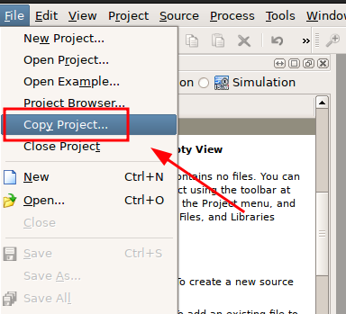
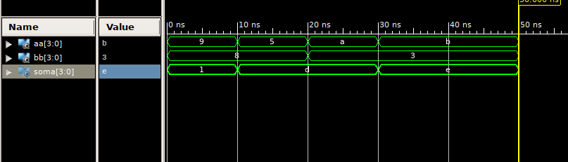

<div align="center">
  
  <h3 align="center">Project 2</h3>
  <p align="center">Expanding the previous project</p>
  <p align="center">
    <a href="./project_files/project_2/">Project Files</a> |
    <a href="./project_1.md">Previous Project</a> |
    <a href="./project_3.md">Next Project</a>
  </p>
</div>

---

<details>
<summary>Table of Contents</summary>
<ol>
  <li><a href="#prerequisites">Prerequisites</a></li>
  <li><a href="#creating">Creating the Project Files</a></li>
  <li><a href="#creating2">Creating a Project in ISE for Nexys 1 or Nexys 2 FPGA's</li>
  <li><a href="#using">Using the Xilinx ISIM Simulator</li>
  <li><a href="#mentors">Mentors</a></li>
</ol>
</details>

> [!IMPORTANT]
> This step-by-step is heavily based on the work of Professor Ney Laert Vilar Calazans, so all credits go to him.

---

### :fountain_pen: Prerequisites

1. Have ISE 14.7 VM installed and configured, if you don't have it, please go [here](https://github.com/LigaProtoFPGA/docs/blob/main/setup-ise-vm.md)
2. Have completed the [previous project](./project_1.md)

---

### :gear: Developing a 4 bit adder from the previous project

1. Create a new project, using the **Copy Project** option in ISE:

<p align="center">
  
</p>

2. Now, change the 1 bit signal declarations to 4 bit, **std_logic_vector(3 down to 0)**, the new VHDL entity should look similar to this:

```vhdl
entity adder4 is
port (A, B: in std_logic_vector(3 downto 0);
    Sum: out std_logic_vector(3 downto 0));
end adder4;
```

3. Eliminate the **carry** and make some changes as shown below, the **architecture** should look like this:

> [!NOTE]
> The VHDL language is **case-insensitive**, which means that **Sum** is equal to **sum**, for example.

```vhdl
architecture comp of adder4 is
begin
    sum <= a + b;
end comp;
```

4. A new line should be included in both this file and the **testbench** to add the sum operator overload, to make possible adding vectors:

```vhdl
use IEEE.std_logic_unsigned.all;
```

---

### :wrench: Changing the testbench

> [!TIP]
> Four bits can be represented as a single hexadecimal digit. In VHDL we can represent hexadecimal constants using the **x** prefix.

1. Alter the testbench, changing the **architecture** contents:

```vhdl
aa <= x"9", x"5" after 10 ns, x"A" after 20 ns, x"B" after 30 ns;
bb <= x"8", x"3" after 20 ns;
```

2. Make some other changes, such as change the type of the signals to **std_vector_logic(3 downto 0)** .Try to simulate the circuit, the compiler should show some errors, fix them by making the necessary changes. If you're having trouble with this part, take a peek at the [project files](./project_files/project_2/).

2. Now simulate the circuit the same way presented in the [previous project](./project_1.md). The waveform should be similar to the one that is being shown below:

<p align="center">
  
</p>

> [!TIP]
> In order to generate all the possible input combinations of this circuit, it would be needed to create 256 patterns, 16 distinct values for A with each 16 unique values for B. This VHDL snippet below can do that. Try to understand it even though you might do not know what is a **process**.

```vhdl
...
signal aa : std_logic_vector(3 downto 0):="0000"; 
signal bb : std_logic_vector(3 downto 0):="0000";
...
process (aa)
begin
  if (aa/=x"F") then
    aa <= aa+x"1" after 10ns;
  else aa <= x"0" after 10ns;
  end if;
end process;

process (bb)
begin
  if (bb/=x"F") then
    bb <= bb+x"1" after 160ns;
  else bb <= x"0" after 160ns;
  end if;
end process;
```

<p align="center">
  <strong>You've reached the end! <a href="project_3.md">Next Project</a></strong>
</p>

---

### :old_key: Mentors

<table border="0" cellspacing="0" cellpadding="10">
  <tr>
    <td>
      <a href="https://github.com/NeyCalazans">
        
      </a>
    </td>
    <td valign="middle">
      <strong>Prof. Ney Calazans</strong>
    </td>
  </tr>
  <tr>
    <td>
      <a href="https://github.com/adelfi172">
        
      </a>
    </td>
    <td valign="middle">
      <strong>Prof. Rodrigo Pereira</strong>
    </td>
  </tr>
</table>