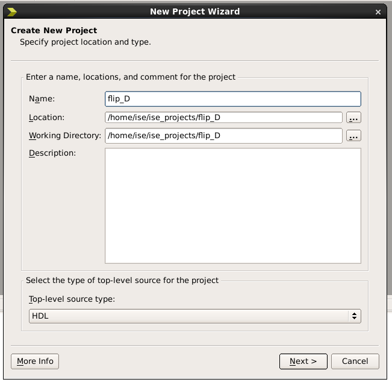
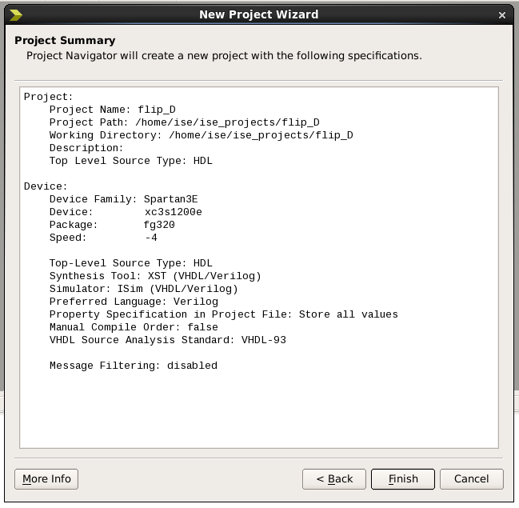
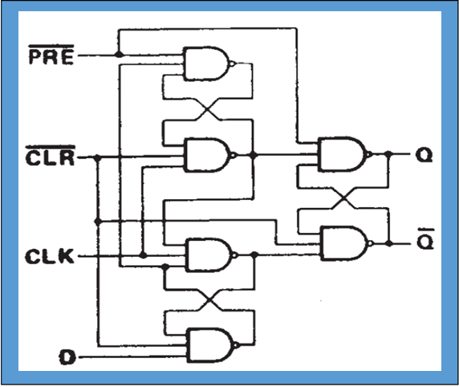
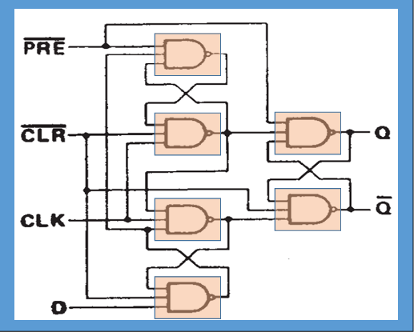
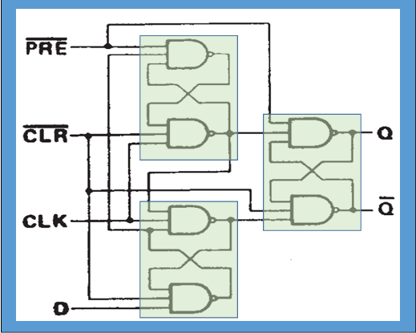

  
  <h3 align="center">Project 3</h3>
  
Making a D-type flip-flop sensitive to the rising edge of the clock

  

    <a href="./project_files/project_3/">Project Files</a> |
    <a href="./project_2.md">Previous Project</a> |
    <a href="./project_4.md">Next Project</a>
  

---

Table of Contents

<ol>
  <li><a href="#prerequisites">Prerequisites</a></li>
  <li><a href="#mentors">Mentors</a></li>
</ol>

> [!IMPORTANT]
> This step-by-step is heavily based on the work of Professor Ney Laert Vilar Calazans, so all credits go to him.

---

### :fountain_pen: Prerequisites

1. Have ISE 14.7 VM installed and configured, if you don't have it, please go [here](https://github.com/LigaProtoFPGA/docs/blob/main/setup-ise-vm.md)
2. Have completed the [previous project](./project_2.md)

---

### :computer: Creating a Project in ISE for Nexys 1 or Nexys 2 FPGA's

1. Open ISE and if a project opens on startup, close it in File then Close Project, as shown below:

  

2. Create a new project named **flip_D** clicking on the button **New Project**, as shown below:

> [!WARNING]
> Choose a folder that you're sure you have permission to write.

  

3. Fill the name field as shown below and click on **Next**:

> [!WARNING]
> Don't use special characters in the project name or path.

  

4. Change the fields according to the board you're using:

For **Nexys 2** with size **1200**:

> [!WARNING]
> If you're using a device with size **500**, choose **XC3S500E** instead.

  

For **Nexys 1**:

  

5. In the final window, check everything and then click on finish, as shown below:

  

---

### :gear: Making a D-type flip-flop sensitive to the rising edge of the clock

  

To make a D-type flip-flop sensitive to the rising edge of the clock, there are 3 possible options of implementation. First, using direct logic, by simply connecting wires. Second, it is possible to subdivide the structure, making an entity for the 3-input NANDs:

  

And lastly, by subdiving it in 4-input latches:

  

